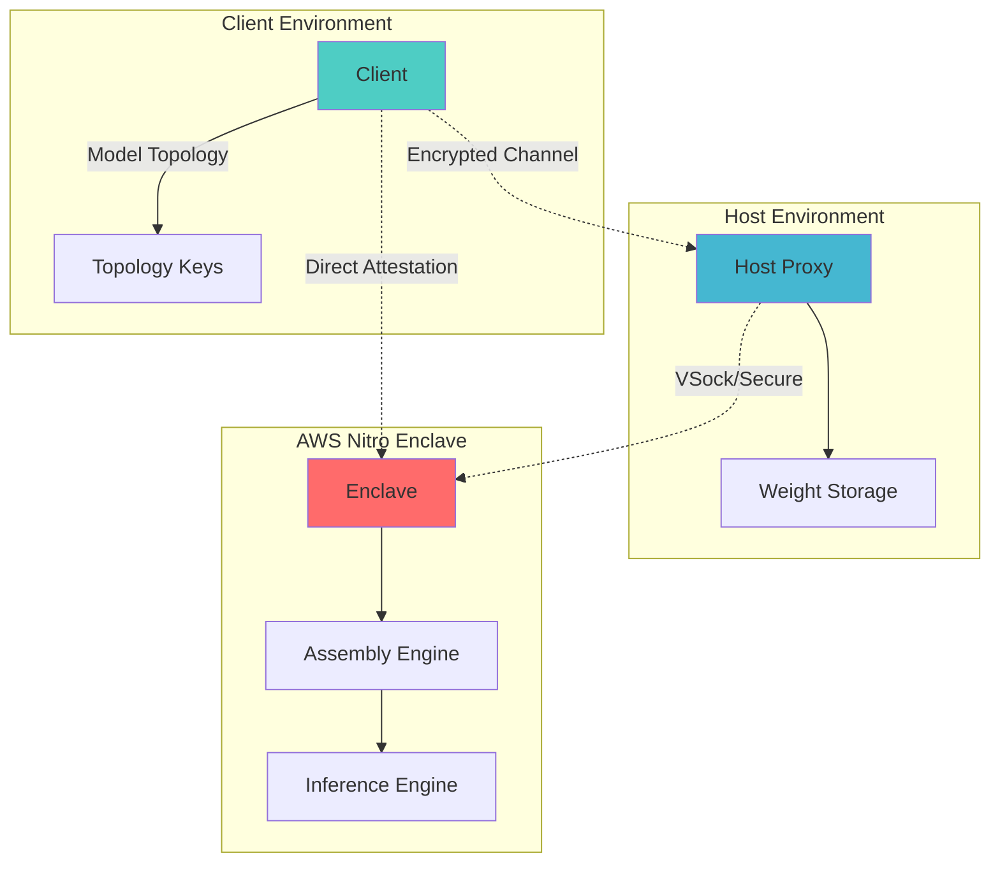

[]()
[]()
[]()
[]()

# 🔒 EphemeralML: Zero-Trust AI Inference

> **Protect your AI models while enabling secure inference**

EphemeralML is a revolutionary zero-trust AI inference system that solves the critical problem of intellectual property protection in AI deployments. By separating neural network weights from topology information and using hardware-based isolation, your models remain secure even in untrusted environments.

## 🎯 Why EphemeralML?

**The Problem**: Traditional AI inference exposes complete models to the execution environment, creating IP theft risks and limiting deployment options in multi-tenant or cloud scenarios.

**Our Solution**: 
- 🔐 **Model Decomposition**: Split models into unstructured weights (stored remotely) and topology keys (kept by client)
- ⚡ **Ephemeral Assembly**: Functional models exist only during inference execution (milliseconds)
- 🛡️ **Hardware Isolation**: AWS Nitro Enclaves provide cryptographically verifiable security
- 🚫 **Zero Trust**: No component has access to complete model information

## 🏗️ Architecture



### Components

- **🖥️ Client**: Handles model decomposition and maintains topology keys
- **🌐 Host**: Unprivileged proxy for weight storage and communication forwarding  
- **🔒 Enclave**: Hardware-isolated environment for secure model assembly and inference

## 🚀 Quick Start

### Development Mode (No AWS Required)

Perfect for local development and testing:

```bash
# Clone the repository
git clone https://github.com/YOUR_USERNAME/ephemeral-ml
cd ephemeral-ml

# Build all components
cargo build

# Terminal 1: Start mock enclave
cd enclave && cargo run

# Terminal 2: Start host proxy  
cd host && cargo run

# Terminal 3: Run client
cd client && cargo run
```

### Production Mode (AWS Nitro Enclaves)

For production deployment with hardware security:

```bash
# Build for production
cargo build --features production --no-default-features

# Deploy to AWS EC2 with Nitro Enclaves support
# (See deployment guide for detailed instructions)
```

## 🧪 Testing

```bash
# Run all tests
cargo test

# Run with mock features
cargo test --features mock

# Run property-based tests (recommended)
cargo test --features mock -- --test-threads=1
```

## 📁 Project Structure

```
ephemeral-ml/
├── 📦 client/           # Model decomposition & secure communication
│   ├── src/decomposer.rs    # ONNX model decomposition
│   ├── src/secure_client.rs # Encrypted client-enclave communication
│   └── src/types.rs         # Client-specific data structures
├── 🌐 host/             # Weight storage & communication proxy
│   ├── src/proxy.rs         # VSock/TCP proxy implementation
│   └── src/storage.rs       # Secure weight storage
├── 🔒 enclave/          # Hardware-isolated inference execution
│   ├── src/assembly.rs      # Ephemeral model assembly
│   ├── src/inference.rs     # Secure inference execution
│   └── src/attestation.rs   # Hardware attestation
├── 📚 common/           # Shared types and utilities
└── 🧪 tests/            # Integration tests
```

## 🔧 Configuration

### Environment Variables

```bash
# Mock mode settings (default)
EPHEMERAL_MOCK_MODE=true
EPHEMERAL_CLIENT_PORT=8080
EPHEMERAL_HOST_PORT=8081
EPHEMERAL_ENCLAVE_PORT=8082

# Logging
RUST_LOG=info
```

### Feature Flags

- `mock` (default): Local development with TCP communication
- `production`: AWS Nitro Enclaves with VSock and real attestation

## 🛡️ Security Model

### Threat Model

✅ **Protected Against**:
- Model theft from compromised hosts
- Inference data interception
- Topology reverse engineering
- Weight extraction attacks

⚠️ **Assumptions**:
- Client environment is trusted
- AWS Nitro Enclaves provide hardware isolation
- Network communication can be monitored (but encrypted)

### Security Guarantees

1. **🔐 Model Confidentiality**: Complete models never exist outside secure enclaves
2. **🛡️ Hardware Attestation**: Cryptographic proof of execution environment
3. **⚡ Ephemeral Assembly**: Models exist only during inference (milliseconds)
4. **🔒 Encrypted Communication**: All data in transit is encrypted and authenticated

## 🚧 Development Status

This project is in active development. Current status:

- ✅ **Architecture Design**: Complete zero-trust system design
- ✅ **Mock Implementation**: Local development environment ready
- 🚧 **Core Features**: Model decomposition, secure assembly, inference engine
- 📋 **Planned**: ONNX support, production deployment, performance optimization

See our internal development roadmap for detailed implementation status.

## 🤝 Community & Feedback

We are currently in an active **R&D phase**. While we are not accepting external code contributions to the core enclave logic at this time (to maintain security audit chains), we welcome community feedback:

- 🐛 **Found a bug?** Please open an [Issue](https://github.com/YOUR_USERNAME/ephemeral-ml/issues).
- 💡 **Have a feature request?** Start a discussion in the Issues tab.
- 🔐 **Security Vulnerabilities:** Please do not open public issues for security flaws. Email security@cyntrisec.com directly.

## 📚 Documentation

- 📖 [Quick Start Guide](QUICKSTART.md) - Get up and running in minutes

## 🔗 Related Projects

- [AWS Nitro Enclaves](https://aws.amazon.com/ec2/nitro/nitro-enclaves/) - Hardware isolation platform
- [Candle](https://github.com/huggingface/candle) - Rust ML framework (planned integration)
- [ONNX](https://onnx.ai/) - Open neural network exchange format

## 📄 License

This project is part of the EphemeralML research initiative.

---

<div align="center">

**🔒 Secure AI • ⚡ Fast Inference • 🛡️ Zero Trust**

[Get Started](#-quick-start) • [Documentation](#-documentation) • [Community](#-community--feedback)

</div>